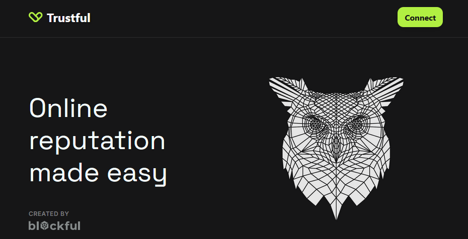

# Start with Trustful

## Test the Trustful playground [here](https://trust.ful.xyz/)

<figure><figcaption></figcaption></figure>

***

## Trustful Demo

## Admin Panel

The Admin Panel provides powerful management tools for users with Root or Manager roles. Each role has specific capabilities to control access and customize the badge system:

### Administrative Functions:

* **Direct Role Assignment:** Root and Manager users can grant roles to any Ethereum address without issuing badges. While this method provides immediate access, it bypasses the badge-based reputation system and should be used judiciously.
* **Access Management:** Administrators can revoke role access when needed, ensuring proper system security and user management.
* **Manager Badge Control**: Root users have the special ability to revoke Manager roles, which automatically revokes the associated Manager badge, effectively removing all Manager privileges.

### Badge Title Management:

* **Title Creation:** Administrators can introduce new badge titles to the system, expanding the types of recognition that can be issued within the community.
* **Title Removal:** When certain badge types are no longer needed, administrators can remove them from the available options, maintaining a clean and relevant badge ecosystem.



## Check-in a villager

When you scan a participant's QR code, you'll be directed to their personalized badge issuance page. As a Manager, you can initiate the check-in process by issuing a special "Check-in" badge to their Ethereum address. This badge serves two important purposes:

1. It grants the VILLAGER\_ROLE to the user, officially registering them as an event participant
2. It creates an immutable record of their attendance on the blockchain

### The check-in process is straightforward:

1. Scan the participant's unique QR code
2. Review the connected wallet address on the badge issuance page
3. Issue the "Check-in" badge to formally register their attendance

Once the check-in badge is issued and confirmed on the blockchain, the participant gains full access to event features and can begin receiving and issuing badges to other verified participants.



## Statement Badge Issuance & Response System

When issuing a Statement Badge to another participant, you can include a personalized comment to provide context or additional information about the recognition. The badge and its associated comment will be permanently displayed in the recipient's "My Badges" page, creating a lasting record of the recognition.

While the badge is permanently recorded on the blockchain and linked to the recipient's address, they have the ability to respond to it in one of two ways:

1. Accept the badge, acknowledging and embracing the recognition
2. Deny the badge, registering their disagreement with the statement

Important Note: Regardless of the recipient's response, the badge remains as an immutable record on the blockchain, linked to their address. This design ensures transparency while still allowing recipients to express their stance on received badges.

All badges and responses are visible in the recipient's badge history, providing a complete picture of their interactions and recognitions within the community.



